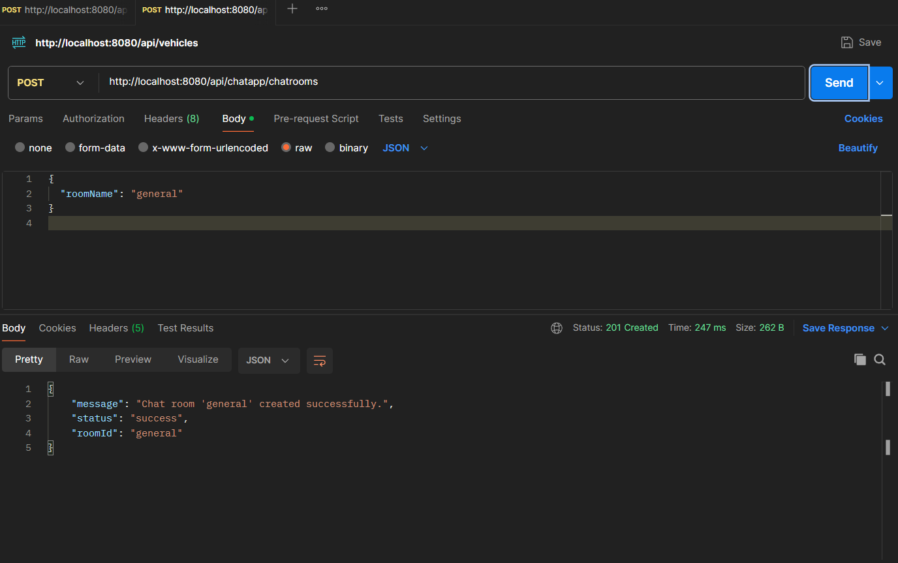
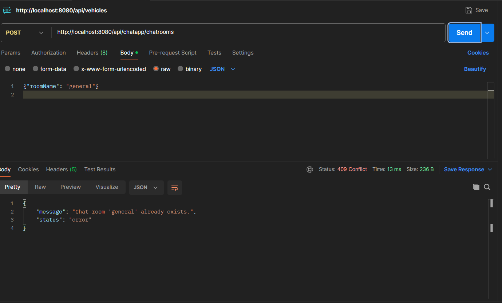
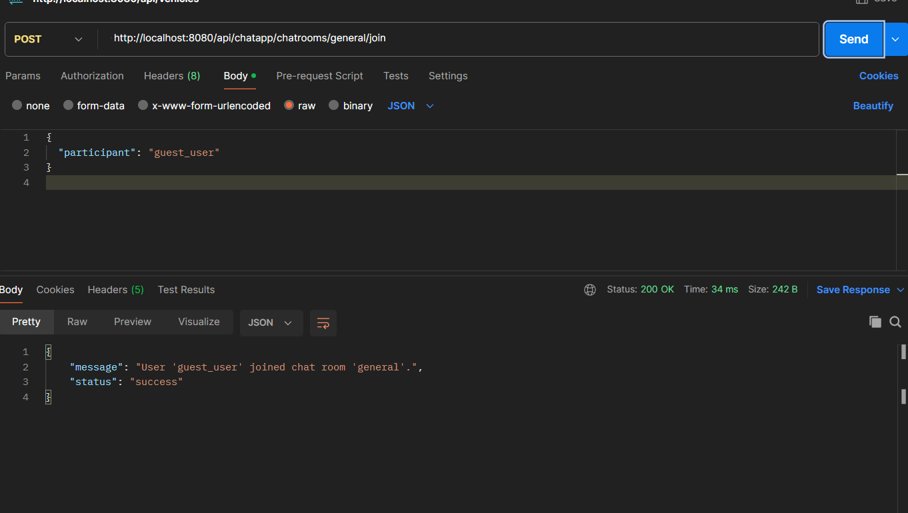
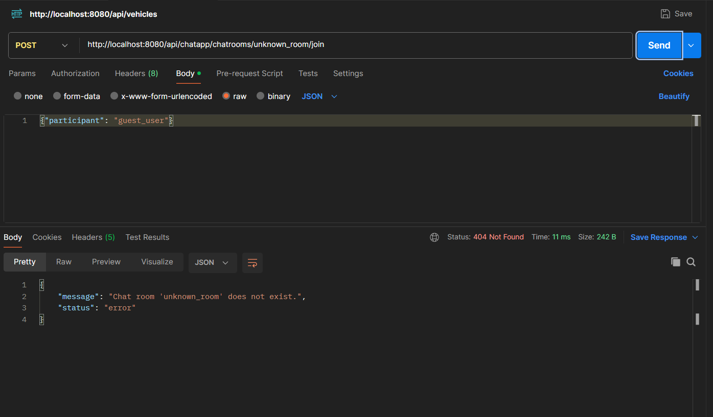
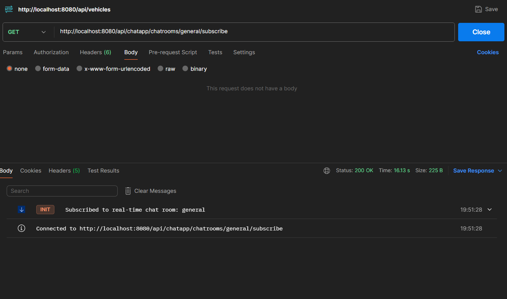
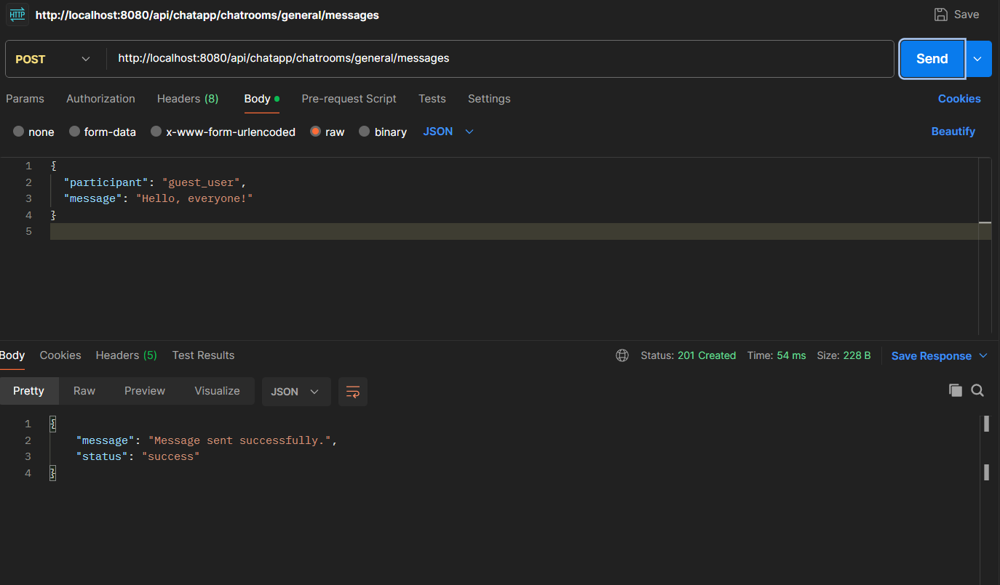
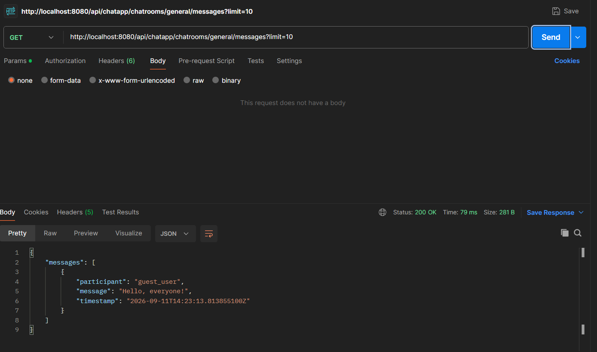

# SIMCHAT-A: Redis Chat Application (Spring Boot)

A REST-only backend service built in Java 17 and Spring Boot using Redis as the primary data store for a multi-room chat system with real-time Pub/Sub fan-out and Server-Sent Events (SSE).

---

## Features & PRD Compliance

1. **Create Chat Room** (`POST /api/chatapp/chatrooms`)
2. **Join Chat Room** (`POST /api/chatapp/chatrooms/{roomId}/join`)
3. **Send Message** (`POST /api/chatapp/chatrooms/{roomId}/messages`)
4. **Retrieve Chat History** (`GET /api/chatapp/chatrooms/{roomId}/messages?limit=N`)
5. **Real-Time Subscription (SSE)** (`GET /api/chatapp/chatrooms/{roomId}/subscribe`)
6. **Delete Chat Room** (`DELETE /api/chatapp/chatrooms/{roomId}`)

---

## Redis Data Model

* **Room Metadata**: `chatroom:{roomId}` (Hash: `roomId`, `roomName`, `createdAt`)
* **Room Registry**: `chatrooms:all` (Set of `roomId`s)
* **Participants**: `chatroom:{roomId}:participants` (Set of usernames/participants)
* **Messages**: `chatroom:{roomId}:messages` (List for `RPUSH` / `LRANGE`)
* **Pub/Sub Channel**: `chatroom:{roomId}:channel` (`PUBLISH` on new message)

---

## How to Run Locally

### 1. Start Redis Server
Using Docker Compose:
```bash
docker-compose up -d
```
*(Or ensure local Redis is running on `localhost:6379`)*

### 2. Run the Spring Boot Application
```bash
mvnw spring-boot:run
```
The server will start on `http://localhost:8080`.

---

## Postman Collection & Testing

A complete Postman Collection is included: [`Simchat_Redis.postman_collection.json`](file:///c:/Users/adity/OneDrive/Desktop/SIMCHAT-A/Simchat_Redis.postman_collection.json).

### Recommended Testing Steps:
1. **Create Room**: `POST http://localhost:8080/api/chatapp/chatrooms` with body `{"roomName": "general"}`
2. **Test Duplicate (409 Conflict)**: Send the same request again.
3. **Join Room**: `POST http://localhost:8080/api/chatapp/chatrooms/general/join` with body `{"participant": "guest_user"}`
4. **Real-Time Stream**: Open `GET http://localhost:8080/api/chatapp/chatrooms/general/subscribe` in Postman or Browser (SSE).
5. **Send Message**: `POST http://localhost:8080/api/chatapp/chatrooms/general/messages` with body `{"participant": "guest_user", "message": "Hello, everyone!"}`
6. **Get History**: `GET http://localhost:8080/api/chatapp/chatrooms/general/messages?limit=10`








